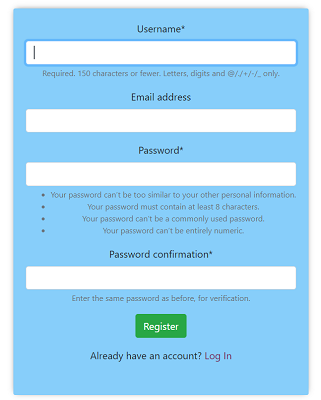

# ShowYourself - Blog app

## Table of contents
* [General info](#general-info)
* [Technologies](#technologies)
* [Setup](#setup)
* [API](#api)
## General info
This projects lets an User create his own blog and discover other people's blogs.\
Project features:
* User authentication system ([Login](#login), [Register](#register), [Password Change](#password-change)).
* API created with Django REST Framework.
* Page restrictions for not logged Users -  using Django decorators.
* Blogger has ability to Create, Edit and Delete his posts. - CRUD functionality.
* Project is using rich text editor to style blog posts.
* Blogger can comment on other user's posts.
* Blogger create form, ability to set a profile photo.
* Search Blogger by given name.
* Website is fully responsible.
## Technologies
Project is created with:
* Python 3.8
* Django 3.1
* Django REST Framework
* HTML
* CSS
* Bootstrap 4
* Unit tests written in Pythin's unittest module
## Setup
To run this project locally clone this repository:
```
$ git clone https://github.com/MattFrankowski/show_yourself.git
```

Install and activate Virtual Enviroment:
```
$ pip install virtualenv
$ python -m virtualenv myvenv
$ myvenv\Scripts\activate 
```

Install the dependencies:
```
$ pip install -r requirements.txt
```

Next, navigate to show_yourself/website directory and in command line type:
```
$ python manage.py makemigrations
$ python manage.py migrate
$ python manage.py runserver
```
Open browser and go to adress http://127.0.0.1:8000/

Website is now running!

## API.
API allows to access Post model information.

Endpoint to get all posts:

http://127.0.0.1:8000/api/post_list/

Endpoint to get a particular Post object information:

http://127.0.0.1:8000/api/post/<<int:post_id>>/

Sample Post info in JSON format:
```json
{
    "id": 1,
    "title": "My trip to France!",
    "content": "Post content.",
    "image": "http://127.0.0.1:8000/media/post_images/chris-karidis-nnzkZNYWHaU-unsplash.jpg",
    "author": "Maya",
    "date_created": "2020-09-20T15:20:38.310976Z"
}
```

## Login


## Register


## Password change
When project is run locally emails for password resseting are sent to *sent_emails* directory as .txt file

## TODO
* Social functionalities (add friends, like posts and comments)
